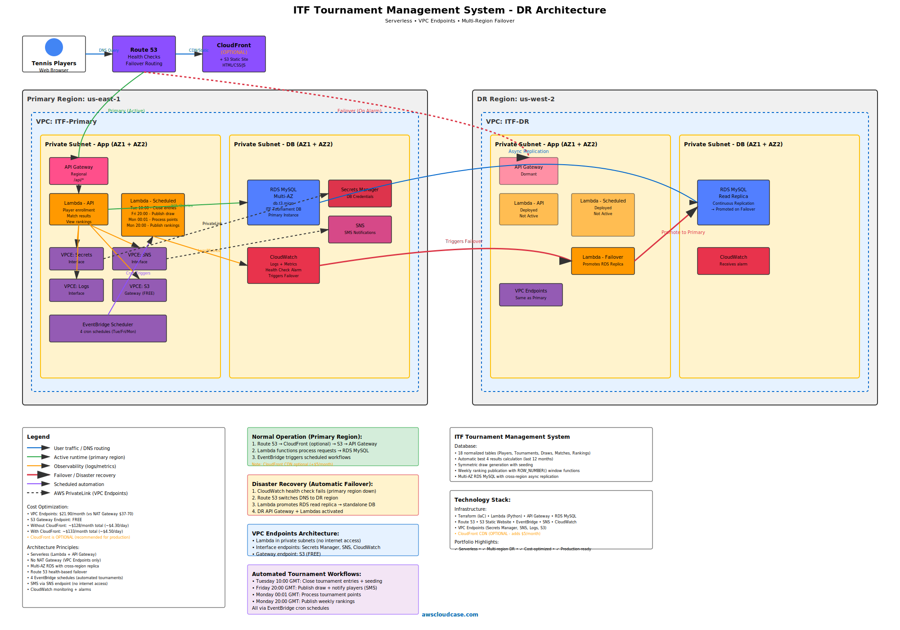
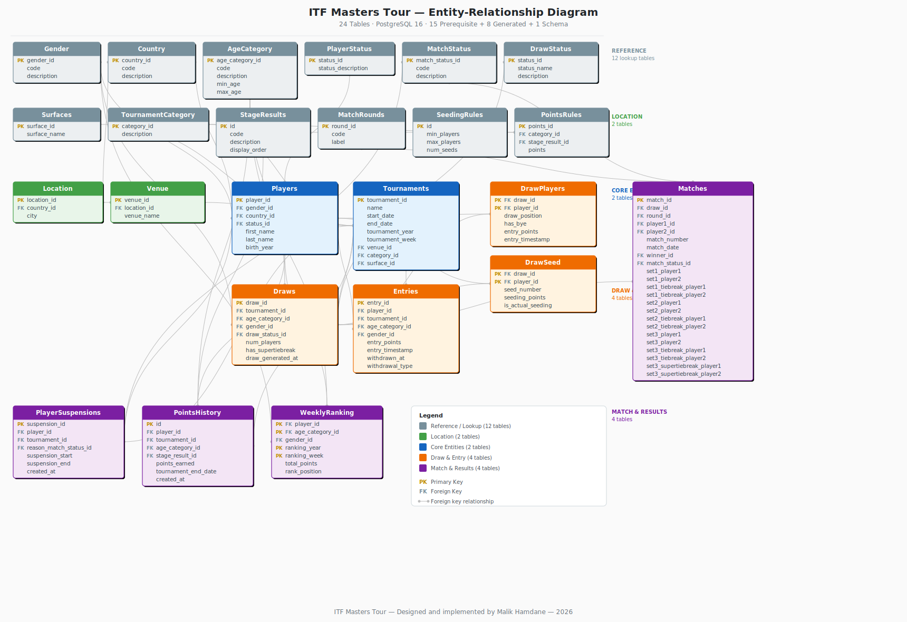

# ITF Masters Tour — Senior Tournament Management System

## 1. Project Overview

This is a fantasy tennis project that replicates the organisation of the ITF (International Tennis Federation) Masters Tour, limited to 2 age categories (60+ and 65+), men and women, singles only. 

All player names are entirely fictitious; any resemblance to real individuals is purely coincidental.

The system handles the full tournament lifecycle: 
- player registration
- entry deadline enforcement
- automated draw generation with seeding and bye assignment
- match skeleton creation
- live result entry with score validation
- points calculation
- weekly ranking publication
- player suspension tracking.

The project serves as a portfolio demonstration of full-stack development, relational database design, and cloud architecture. 

The local application is a Flask web app backed by PostgreSQL (Docker).  
A short-lived AWS deployment was carried out to demonstrate disaster recovery, and torn down after evidence collection.

All business logic is governed by three sources of truth: 
- `Rules.md` (ITF tournament rules)
- `create_itf_schema.sql` (database schema with CHECK constraints)
- `repository_structure.md` (canonical file layout). 

Every Python script implements the rules defined in these files.


## 2. Architecture

### 2.1 Local Stack

```
Browser → Flask (`app.py`, 20 routes) → Service Layer → PostgreSQL 16 (Docker)
```

The Flask application runs locally via `run_local.sh`. 
It connects to a PostgreSQL 16 instance running in a Docker container (`itf-postgres`). 
The service layer encapsulates all business logic, keeping Flask routes thin.

It includes the following modules:
- `entry_service.py`
- `draw_service.py`
- `match_service.py`
- `view_service.py`


### 2.2 AWS Deployment (completed and torn down)
```
Route53 (awscloudcase.com) → ALB → Fargate (Flask) → RDS PostgreSQL
```

The infrastructure spans two AWS regions for disaster recovery demonstration.

**Compute layer — AWS Fargate**   
It runs the Flask application as a Docker container (the same image used locally) without managing EC2 instances.  

There is one Fargate task running per region:  
An active task in the primary region.  
A standby task in the DR region. 

Fargate tasks sit in **private subnets**.  
The ALB sits in **public subnets** and forwards traffic to them.

**ALB → Fargate → RDS interaction**  
A browser request hits the ALB on port 443 (HTTPS, terminated by the ACM certificate).  
The ALB forwards the request to the Fargate target group on port 5000 (Flask's default).  
Flask processes the route (e.g. /admin, /draw/233), calls the service layer, which opens a psycopg2 connection to RDS PostgreSQL on port 5432.  
RDS returns query results → Flask renders a Jinja2 template → response flows back through ALB → browser.  
The ALB also performs health checks (e.g. GET / every 30 seconds) against Fargate to confirm the task is healthy.   
CloudWatch monitors these.

**Database layer — RDS PostgreSQL 16** (`db.t4g.micro`)   
It runs in private subnets with Multi-AZ in the primary region and a cross-region read replica in the DR region.

**Networking and DNS**  
`Route53` resolves `awscloudcase.com` with health-check failover routing.  
`ACM` provides the TLS certificate.   
4 `VPC Endpoints` to replace `NAT Gateways` in order to reduce cost.

Fargate tasks run in private subnets — no internet access.   
Yet to reach AWS services, VPC Endpoints provide private connectivity without a NAT Gateway:
- VPCE: Secrets Manager — Fargate retrieves the RDS database credentials (username, password) at startup. Without this endpoint, the container cannot connect to PostgreSQL.
- VPCE: Logs (CloudWatch) — Fargate sends container stdout/stderr to CloudWatch Logs.   
    Every Flask request, error, and health check response gets logged here.
- VPCE: ECR — Fargate pulls the Docker image from Elastic Container Registry when a task launches.   
    Without this, the container image cannot be downloaded.
- VPCE: S3 (Gateway) — ECR stores Docker image layers in S3, so this endpoint is required alongside the ECR endpoint.   
    It is free (gateway type, unlike the other three which are interface type and cost ~$7/month each).

**Disaster recovery**  
If the primary region health check fails, `Route53` reroutes traffic to the DR region ALB.   
The RDS read replica is promoted to a standalone primary.

**Storage**  
S3 stores screenshot evidence and deployment artifacts, persisting after teardown.

**Terraform**  
It manages all resources.   
The deployment remains online for a maximum of 2 days.  
This is long enough to collect screenshot evidence — before teardown.




### 2.3 Development Tools

| Tool | Purpose |
|------|---------|
| PyCharm Professional | Python development, debugging, project navigation |
| DataGrip | SQL queries, database inspection, data verification |
| Docker Desktop | PostgreSQL container (`itf-postgres`) |
| WSL2 | Linux environment on Windows |
| Flask | Web application framework |
| psql | Command-line SQL execution for bulk imports |


## 3. Key Business Rules

The complete rule set is defined in `Rules.md`. Below is a summary of the most significant rules enforced by the system.

### 3.1 Age Eligibility

A player qualifies for an age category (60+ or 65+) if the required age is reached during the calendar year of the competition. 

Each ranking is category-specific: a player changing category starts with zero points in the new one.


### 3.2 Entry and Scheduling

The entry deadline is every Tuesday at 10:00 UTC for the tournament starting the following week. 

A minimum of 6 players per draw is required; the maximum is 64. 

Tournaments run Monday to Sunday.


### 3.3 Draw Generation and Seeding

Draw sizes are powers of 2 (8, 16, 32, 64). 

Byes fill the remaining positions: 
- seeded players receive byes first (in seed order)
- unseeded players receive byes randomly. 

Seeding is based on the weekly ranking published the Monday before the entry deadline.

Seeding brackets: 
- 6–8 players → 2 seeds; 
- 9–16 → 4 seeds; 
- 17–32 → 8 seeds; 
- 33–64 → 16 seeds. 

Seeds are placed so that the top 2 cannot meet before the final, seeds 3–4 not before the semi-finals, and so on. 

Tournaments 1 and 2 have no seeding (no ranking existed yet).


### 3.4 Scoring

Each set is won at 6 games with a 2-game margin, or via a tiebreak at 6–6 (first to 7 points, win by 2). 

If the match is split at one set each, a third set is played. 

The format of the third set depends on `Draws.has_supertiebreak`: 
- when `TRUE` (75% of draws), a super-tiebreak replaces the third set (first to 10 points, win by 2); 
- when `FALSE` (25%), a normal third set is played.


### 3.5 Points and Rankings

Points are allocated by tournament category and stage result (see `PointsRules`). 

First-match losers receive zero points regardless of the stage. 

The weekly ranking, published every Monday at 20:00 UTC, sums each player's best 4 results over the previous 52 weeks.


### 3.6 Suspensions
There are two types of suspensions:
- a no-show or post-draw withdrawal (`match_status_id = 3`) triggers a 2-month suspension. 
- a disqualification during a match (`match_status_id = 6`) triggers a 6-month suspension. 

In both cases, all points earned in that tournament are forfeited. 

A retirement (`match_status_id = 4`) carries no suspension and no point forfeiture — partial scores are preserved.


## 4. Data Pipeline

The database is populated in two phases, and the project uses two distinct workflows:
- **Tournaments 1–58 (script-generated):** All entries, draw players, matches, points, and rankings were produced by Python scripts enforcing the rules from `Rules.md`. 
    This bulk historical data establishes 54 weeks of realistic tournament history.
- **Tournament 59 (manually entered):** Entries, draws, and match results were entered via the Flask admin panel. 
    Scripts were only used for debugging and for updating match dates to align with the tournament 59 week. 
    This workflow demonstrates the live application as it would operate in production.
- **Tournament 60 onward (fully manual):** No generation scripts are needed. 
    Entries, draws, and results entered via the frontend automatically update all linked tables (`PointsHistory`, `WeeklyRanking`, `PlayerSuspensions`).

Prerequisite (reference) data was created manually; generated data was produced by scripts.

### 4.1 Prerequisite Data (15 tables — static reference)

These tables contain manually curated reference data: 
- `AgeCategory`
- `Country`
- `DrawStatus`
- `Gender`
- `Location`
- `MatchRounds`
- `MatchStatus`
- `Players`
- `PlayerStatus`
- `PointsRules`
- `SeedingRules`
- `StageResults`
- `Surfaces`
- `TournamentCategory`
- `Venue`
- `Tournaments`
- `Draws` for tournament_id 1–58.

Excel source files are in `data/extracts/prerequisites/`. 

SQL insert scripts are in `data/sql/prerequisites/`.


### 4.2 Generated Data (8 tables — computed by scripts)

These tables are populated by the generation and recalculation pipeline: 
- `Entries`
- `DrawPlayers`
- `DrawSeed`
- `Draws` (from tournament_id 59 onward)
- `Matches`
- `PlayerSuspensions`
- `PointsHistory`
- `WeeklyRanking`.

Excel exports are in `data/extracts/generated/`. 

SQL insert scripts are in `data/sql/generated/`.




### 4.3 Execution Order

From the project root, with Docker PostgreSQL running:

```bash
# Step 1 — Create schema (24 tables)
psql -h localhost -p 5432 -U <username> -d itf_tournament -f data/sql/schema/create_itf_schema.sql

# Step 2 — Load prerequisite data
psql -h localhost -p 5432 -U <username> -d itf_tournament -f data/sql/prerequisites/_run_all_prerequisites.sql

# Step 3 — Load generated data (tournaments 1–58)
psql -h localhost -p 5432 -U <username> -d itf_tournament -f data/sql/generated/_run_all_generated_1to58.sql

# Step 4 — Load generated data (tournament 59)
psql -h localhost -p 5432 -U <username> -d itf_tournament  -f data/sql/generated/_run_all_generated_59.sql
```

### 4.4 Row Counts (after full load)

| Table | Rows |
|-------|------|
| Entries | 10,906 |
| DrawPlayers | 10,906 |
| DrawSeed | 3,596 |
| Matches | 6,710 |
| PlayerSuspensions | 10 |
| PointsHistory | 10,906 |
| WeeklyRanking | 11,236 |


## 5. Code structure - `/scripts/`and `/src/` structure
There is a fundamental difference between these two folders:

**The `/src/` directory:**
- src/ contains reusable library modules — pure functions and classes with no entry point. 
- Nothing in `src/` is run directly. 
- These modules are imported by everything else: 
    - generation scripts
    - recalculation scripts
    - validation scripts
    - Flask services. 
- They implement the business rules (`Rules.md`) in a single place, so that logic is never duplicated.

**The `/scripts/`directory:**
- It contains executable workflows — files that are run directly (via CLI or called by Flask).
- These files orchestrate the `src/` modules to produce a concrete outcome: 
    - generate 10,000 entries
    - recalculate rankings
    - validate a dataset
    - handle a Flask route.

The dependency flows one way: `scripts/` imports from `src/`, never the reverse.

### 5.1 `/src/modules/`  
This implements pure business logic (rules engine, score generator, seeding, ranking window, etc.):
- `rules_engine.py` — centralised Rules.md implementation (probabilities, score weights, deadline calculations)
- `score_generator.py` — generates tennis scores respecting all distributions from `Rules.md`
- `seeding_engine.py` — seed placement logic (top 2 opposite halves, 3-4 in correct quarters, etc.)
- `weighted_sampler.py` — reusable utility for weighted random selection
- `match_scheduler.py` — assigns match dates (one match per player per day constraint)
- `ranking_window.py` — 52-week rolling window, best-4 calculation
- `calculate_points_history.py` — points earned per player per tournament via PointsRules
- `calculate_weekly_ranking.py` — weekly ranking publication using `ranking_window`
- `generate_player_suspensions.py` — 2-month / 6-month suspension logic
- `db_connection.py` — PostgreSQL connection wrapper


### 5.2 `/scripts/generation/`
This implements a one-time bulk data creation (tournaments 1–58), with a specific execution order:
- `generate_entries.py`
- `generate_draw_players.py` 
- `generate_draw_seed.py` 
- `generate_matches.py`  

Must run in that order (each depends on the previous output).


### 5.3 `/scripts/recalculation/`
These are re-run scripts for tournament 59+ and exports:
- `recalculate_points.py`, `recalculate_rankings.py`, `regenerate_matches.py`
- `generate_ranking_year2026_weeks7and8.py` — specific ranking recalculation
- `export_all_generated_xlsx.py` — exports generated tables to Excel
- `generate_outputs_t59.py` — tournament 59 specific outputs


### 5.4 `/scripts/validation/`
These are gate checks that must pass before data is accepted:
- `validate_tennis_matches.py`
- `validate_draw_players.py`
- `validate_itf_data.py`


### 5.5 `/scripts/services/`
Flask service layer (called by `app.py routes`): see section 6.2
They are thin wrappers that call `src/modules/` functions:
- `entry_service.py`
- `draw_service.py`
- `match_service.py`
- `view_service.py`


## 6. Flask Application

### 6.1 Routes (20 total)

**Page routes (6):** tournament list, tournament detail, draw bracket view, rankings, admin panel, home redirect.

**Admin POST routes (4):** create entry, generate draw, create match skeleton, submit result.

**JSON API routes (10):** player search, reference data, tournament list, tournament info, tournament entries, tournament draws, draw info, draw matches, player ranking, plus supporting endpoints.

### 6.2 Service Layer

| Module | Responsibility |
|--------|---------------|
| `entry_service.py` | Deadline enforcement, entry insertion, entry-point snapshot |
| `draw_service.py` | Draw creation, seeding, bye assignment, DrawPlayers + DrawSeed population |
| `match_service.py` | Skeleton creation, score validation, result application, winner propagation, suspension creation |
| `view_service.py` | Score formatting (winner perspective), bracket rendering data |

### 6.3 Admin Workflow (Tournament 59 example)

1. **Enter players** — admin panel → entries close at Tuesday 10:00 UTC
2. **Generate draw** — admin clicks "Generate Draw" after the deadline → seeds assigned, byes placed, skeleton created
3. **Submit results** — admin enters scores per match → validation runs, winner advances to next round
4. **Recalculate** — `generate_outputs_t59.py` computes PointsHistory and WeeklyRanking for the completed tournament

### 6.4 Templates

Six Jinja2 templates styled with Tailwind CSS: `base.html`, `tournaments.html`, `tournament_detail.html`, `draw.html` (bracket with connector lines, seed badges, champion banner), `rankings.html`, `admin.html` (smart dropdowns, client-side score validation).


## 7. Database

### 7.1 Schema Summary

24 fully normalised tables (3NF) with composite primary keys where appropriate (`DrawSeed`, `DrawPlayers`, `WeeklyRanking`), comprehensive foreign keys, and CHECK constraints enforcing tennis scoring rules directly at the database level. See `data/sql/schema/create_itf_schema.sql`.

Notable constraints on `Matches`: tiebreak fields are required if and only if a set score is 7–6; the third set cannot have both a normal set score and a super-tiebreak; a third set is required if and only if the first two sets are split. Retired and disqualified matches (`match_status_id IN (4, 6)`) are exempt from these constraints to accommodate partial scores.

### 7.2 Validation Checks (10 queries)

All queries are in `data/sql/queries/`. Each returns `PASS` with 0 bad rows when the data is correct.

| # | Check | Query file |
|---|-------|-----------|
| 1 | First-match losers get 0 points | `first_match_losers_0points.sql` |
| 2 | WeeklyRanking uses best 4 results only | `best4results_only_in_weeklyranking.sql` |
| 3 | DQ and no-show get 0 points | `dq_noshow_0points.sql` |
| 4 | Suspension durations correct (2 or 6 months) | `suspension_durations_correct.sql` |
| 5 | Every DrawPlayers row has a matching Entry | `each_drawplayer_matching_entry.sql` |
| 6 | Rank positions sequential (no gaps) per category/week | `rank_positions_no_gap_within_cat_and_week.sql` |
| 7 | Match winner is player1 or player2 | `match_winner_is_player1_or_2.sql` |
| 8 | Completed match winner won exactly 2 sets | `completed_match_winner_won_2sets.sql` |
| 9 | Tiebreak winner matches set winner | `tiebreak_winner_completed_matches_set_winner.sql` |
| 10 | Entries contain only age-eligible players | `entries_with_only_age_eligible_players.sql` |


## 8. Repository Structure

[Repository Structure](docs/repository_structure.md)


## 9. Local Setup

### 9.1 Prerequisites

- Python 3.12+
- Docker Desktop (for PostgreSQL)
- `pip install flask psycopg2-binary`
- PyCharm Professional (recommended) and DataGrip (recommended) for development and database inspection


### 9.2 Start PostgreSQL

```bash
docker run -d --name itf-postgres \
  -e POSTGRES_USER=<username> \
  -e POSTGRES_PASSWORD=<password> \
  -e POSTGRES_DB=itf_tournament \
  -p 5432:5432 \
  postgres:16
```

### 9.3 Load Data

Run the four SQL steps described in section 4.3.

### 9.4 Configure Environment

Copy `.env.example` to `.env` and set credentials to match the Docker container above:

```
DB_HOST=localhost
DB_PORT=5432
DB_NAME=itf_tournament
DB_USER=<username>
DB_PASSWORD=<password>
```

### 9.5 Launch Flask

```bash
chmod +x run_local.sh
./run_local.sh
```

### 9.6 Browse

| URL | Page |
|-----|------|
| `http://127.0.0.1:5000/tournaments` | Tournament list |
| `http://127.0.0.1:5000/tournament/59` | Tournament 59 detail (entries + draws) |
| `http://127.0.0.1:5000/draw/233` | Draw 233 bracket (Men's 60, Tournament 59) |
| `http://127.0.0.1:5000/rankings` | Weekly rankings |
| `http://127.0.0.1:5000/admin` | Admin panel (entry, draw, skeleton, results) |


## 10. Challenges

Building this system over approximately 3 weeks surfaced several categories of problems.

### 10.1 Schema Constraints vs. Real Tennis Scenarios

The initial CHECK constraints on the `Matches` table enforced strict scoring validation:
- tiebreak required at 7–6
- third set required when sets are split. 

This worked for completed matches but rejected retired and disqualified matches outright, since those legitimately contain partial scores. 
The fix was adding `match_status_id IN (4, 6)` exemptions to every constraint, then re-importing 6,666 match rows. 
The debugging cycle involved isolating exactly 81 failing INSERT statements from thousands of lines of output, diagnosing the constraint name from each error, and iterating on the schema.


### 10.2 Tiebreak and Super-Tiebreak Enforcement

Early generated data contained impossible tiebreak scores in normal third sets (e.g., 10–5 or 11–6 where the maximum is 7 without an extended tiebreak). 
The root cause was that the generation logic was not consulting `Draws.has_supertiebreak` to decide the third-set format. 
Fixing this required tracing 27 individual match_id violations, correcting the score generator to respect the draw-level flag, and re-validating the full dataset.


### 10.3 Weekly Ranking Calculations

The "best 4 results over the previous 52 weeks" rolling window required precise ISO week arithmetic. 
Initial implementations miscounted week boundaries around year transitions, producing 6,467 incorrect ranking rows. 
The fix involved aligning the window start/end to ISO weeks rather than calendar dates and re-running the full ranking pipeline.


### 10.4 Draw Generation Bugs (Tournament 59)

Three bugs prevented successful draw generation for the live tournament: 
- a missing `draw_status_id` parameter in the Flask route
- a seeding rules query that fetched all rules without filtering by player count
- a reference to a non-existent `draw_size` column in `SeedingRules`. 

Each required tracing through the full call chain from Flask route → `draw_service.py` → `generate_draw_players.py`. 
The result was bye-against-bye placements and missing seeds — visible immediately on the bracket UI.


### 10.5 Score Display and Winner Propagation

Match scores were initially displayed from the perspective of player1 rather than the winner, producing confusing reversed scores on the bracket. 
Separately, players receiving a bye were not being marked as first-round winners, breaking bracket progression. 
Both were service-layer bugs in `match_service.py` and `view_service.py`.


### 10.6 AI-Assisted Development

Multiple AI models were used during development (ChatGPT, Claude Sonnet 4.5, Claude Opus 4.6).  
Several recurring issues emerged:
- AI-generated schemas often missed tables, hardcoded values instead of creating reference tables with foreign keys, and struggled with the complexity of a 24-table normalised design.  
- Scripts frequently referenced wrong column names — errors that seemed avoidable given the schema was provided in the prompt.  
Prior experience with large relational databases made some errors easy to catch, others less so.  
Without that background, building a similar project with AI assistance alone would be significantly harder.  
Precise prompting helps in theory, but in practice, models routinely override explicit instructions with their own assumptions.  
The effective workflow was iterative: generate, inspect, correct, re-prompt — treating AI output as a first draft rather than a finished product.


## 11. Cost Analysis

### 11.1 Why Fargate

This is a disaster recovery portfolio project, not a long-running production system. 
The compute layer (Fargate vs. EC2) matters less than the DR infrastructure it demonstrates (Route53 failover, cross-region RDS replication, health checks). 
At a 2-day timescale, the cost difference between Fargate and EC2 is approximately $1. 
Fargate is the better portfolio choice: it demonstrates container orchestration without EC2 instance management.

**What is Fargate?**
A serverless container runtime, which runs Docker containers without managing EC2 instances. 
The Flask app gets packaged as a Docker image (the same one used locally).
Fargate runs it as a long-lived web server. 
No code changes needed.

**Where does it sit?**
In private subnets. 
The ALB (public subnets) receives traffic and forwards it to Fargate. 
So the flow is: Route53 → ALB (public) → Fargate (private) → RDS (private).

**There are 2 Fargates**
One Fargate task per region (primary + DR), each running the same Flask container image.

**Why not Lambda + API Gateway?**
The project is a long-running web server. It consists of:
- a Flask web app with 20 routes
- Jinja2 templates
- an admin panel. 

Lambda is designed for short-lived, event-driven functions. 
Using Lambda would mean decomposing the entire Flask app into individual functions.
That would be a significant rearchitecture for zero benefit on a 2-day deployment.

**SNS / EventBridge?**
Not needed as the old diagram assumed automated scheduling (entry deadlines, draw publication, rankings). 
In reality, all of this is done manually through the admin panel. 
No scheduled triggers exist.

**S3 and domain (`awscloudcase.com`)**
Both stay in the diagram:
- `S3` for storing evidence/screenshots after teardown. 
- `awscloudcase.com` via `Route53` + `ACM`.

**Cost difference?**
At 2-day scale: Fargate ~$1.50 vs Lambda ~$0.10. Negligible — architecture fit matters more.


### 11.2 Two-Day Cost Estimate (2 regions)

| Service | 2-day cost |
|---------|-----------|
| Fargate (0.25 vCPU, 0.5 GB × 2 regions) | ~$1.50 |
| RDS db.t4g.micro (primary + replica) | ~$2.00 |
| ALB (× 2 regions) | ~$2.00 |
| Route53 (hosted zone + health checks) | ~$1.50 |
| ACM | Free |
| **Total** | **~$7–8** |

The monthly cost would be $30–40 if left running. The infrastructure is destroyed after screenshot collection, keeping the total well under $10. VPC Endpoints are used instead of NAT Gateways, saving approximately $15/month ($21.90 vs. $36–50).


## 12. GitHub

The complete codebase — Python scripts, SQL files, Excel extracts, Jinja2 templates, ER diagrams, and screenshot evidence — is pushed to a GitHub repository. 
This serves as the permanent record of the project after AWS teardown.

A `.gitignore` file excludes files that should not be committed:
- `.env`
- `__pycache__/`
- `*.pyc`
- `.idea/`
- `venv/`
- `.DS_Store`
- `*.log`
- `.vs/`
- `~$*`
- `.terraform/`
- `terraform.tfvars`
- `terraform.tfstate`
- `terraform.tfstate.backup`

The repository includes:
- All source code and configuration files
- SQL schema, prerequisite data, and generated data (both `.sql` and `.xlsx`)
- 30+ validation and diagnostic queries
- Screenshot evidence of the working application (draw skeletons, match lists, admin panel)
- Documentation (`Rules.md`, architecture docs, ER diagrams)

### 12.1 Install GitHub on WSL
```bash
sudo apt install gh
gh auth login
gh repo delete <username>/ITF-Project --yes
```

**"delete-repo scope" needed to delete the repository**
```bash
gh auth refresh -h github.com -s delete_repo
```
Then follow the prompts, enter the code in https://github.com/login/device > re-run the delete command > confirm deletion on the web interface.


### 12.2 Create the repository on GitHub
```bash
gh repo create fred1717/ITF-Masters-Tour --public --description "Fantasy ITF Masters Tour — Senior Tennis Tournament Management System" --source . --push=false
```


### 12.3 Create `.gitignore`
```bash
cat > .gitignore << 'EOF'
.env
__pycache__/
*.pyc
.idea/
venv/
.DS_Store
*.log
.vs/
~$*
.terraform/
terraform.tfvars
terraform.tfstate
terraform.tfstate.backup
EOF
```


### 12.4 Initialise, add, commit, push
```bash
git init
git branch -M main
git remote add origin https://github.com/fred1717/ITF-Masters-Tour.git
git add .
git commit -m "Initial commit — full local project with Flask, PostgreSQL schema, 59 tournaments"
git push -u origin main
```

**Final commit (after AWS deployment and evidence collection):**
```bash
git rm session-manager-plugin.deb
git rm itf_backup.dump
git add README.md docs/repository_structure.md .gitignore evidence/screenshots/live/
git status
git commit -m "Final README with completed AWS deployment, updated .gitignore, live evidence screenshots"
git push
```


## 13. AWS Deployment

### 13.1 Prerequisites

- AWS CLI configured with valid credentials
- Terraform ≥ 1.5 installed
- Docker Desktop running
- Route53 hosted zone for `cloudcase.com` already exists in the AWS account. 


### 13.2 Setting up the hosted zone for `cloudcase.com`
**Ensure `aws configure` has been run beforehand with valid credentials (access key, secret key, default region)**
```bash
aws sts get-caller-identity
```
**Expected output**
```json
{
    "UserId": "AID*******",
    "Account": "1802********",
    "Arn": "arn:aws:iam::1802********:user/Malik"
}
```

**Checking the hosted zone exists for `awscloudcase.com`**
```bash
aws route53 list-hosted-zones --query "HostedZones[?Name=='awscloudcase.com.'].[Id,Name]" --output table
```
**Example output**
                    ListHostedZones                     |
+------------------------------------+---------------------+
|  /hostedzone/Z023982439K9GBELWF4Z4 |  awscloudcase.com.

**Confirm everything is set up**
```bash
sudo apt install bind9-dnsutils
dig awscloudcase.com NS +short
```
**Expected output**
ns-1673.awsdns-17.co.uk.
ns-1009.awsdns-62.net.
ns-1084.awsdns-07.org.
ns-135.awsdns-16.com.


### 13.3 Dockerfile

The Flask application is packaged as a Docker image for Fargate. The `Dockerfile` lives at the project root.
It also needs a file called `requirements.txt` at the project root.
```bash
pip freeze > requirements.txt
```

The Dockerfile also needs 2 packages to be added: 
- `postgresql-client` (provides `pg_restore`) 
- `awscli` (to download from S3). 

**Fargate also needs `gunicorn` as the production WSGI server**
```bash
pip install gunicorn
pip freeze > requirements.txt
```

### 13.4 Infrastructure Provisioning

From the `terraform/` directory:
```bash
cp terraform.tfvars.example terraform.tfvars
# Edit terraform.tfvars — insert the hosted_zone_id

terraform init
terraform plan
```
- `terraform init` downloads the AWS and random providers. 
- `terraform plan` validates everything and shows what would be created — no resources, no cost.

**Checking for warnings after running 'terraform plan' (huge output, impossible to check line by line)**
```bash
terraform plan 2>&1 | grep -i "warning"
```
**Hoped output** No warning at all!

That means it is now safe to proceed with `terraform apply` (10-15 minutes). Billing will start at that point.
```bash
terraform apply
```

Terraform creates all resources across both regions: 
- VPC
- subnets
- security groups
- VPC Endpoints
- ALB
- Fargate cluster and task definition
- RDS PostgreSQL (primary + cross-region replica)
- ACM certificate
- Route53 failover records
- health check
- S3 evidence bucket.


### 13.5 Debugging
#### 13.5.1 Error 1 
Route53: An existing A record for awscloudcase.com already exists in the hosted zone, blocking the failover records. 
Check what it is. The command can be run from any directory:  
```bash
aws route53 list-resource-record-sets --hosted-zone-id Z023982439K9GBELWF4Z4 --query "ResourceRecordSets[?Name=='awscloudcase.com.']" --output table
```
**Example output**
                                              ListResourceRecordSets                                                |
+-------------------------------------------------------------------+----------------------+--------------------------+
|                               Name                                |         TTL          |          Type            |
+-------------------------------------------------------------------+----------------------+--------------------------+
|  awscloudcase.com.                                                |                      |  A                       |
+-------------------------------------------------------------------+----------------------+--------------------------+
||                                                    AliasTarget                                                    ||
|+------------------------------------------------------------------------+-----------------------+------------------+|
||                                 DNSName                                | EvaluateTargetHealth  |  HostedZoneId    ||
|+------------------------------------------------------------------------+-----------------------+------------------+|
||  dualstack.alb-primary-regiona-1372282612.us-east-1.elb.amazonaws.com. |  True                 |  Z35SXDOTRQ7X7K  ||
|+------------------------------------------------------------------------+-----------------------+------------------+|
|                                               ListResourceRecordSets                                                |
+--------------------------------------------------------------+------------------------------+-----------------------+
|                             Name                             |             TTL              |         Type          |
+--------------------------------------------------------------+------------------------------+-----------------------+
|  awscloudcase.com.                                           |  172800                      |  NS                   |
+--------------------------------------------------------------+------------------------------+-----------------------+
||                                                  ResourceRecords                                                  ||
|+-------------------------------------------------------------------------------------------------------------------+|
||                                                       Value                                                       ||
|+-------------------------------------------------------------------------------------------------------------------+|
||  ns-1673.awsdns-17.co.uk.                                                                                         ||
||  ns-1084.awsdns-07.org.                                                                                           ||
||  ns-1009.awsdns-62.net.                                                                                           ||
||  ns-135.awsdns-16.com.                                                                                            ||
|+-------------------------------------------------------------------------------------------------------------------+|
|                                               ListResourceRecordSets                                                |
+-------------------------------------------------------------------+----------------------+--------------------------+
|                               Name                                |         TTL          |          Type            |
+-------------------------------------------------------------------+----------------------+--------------------------+
|  awscloudcase.com.                                                |  900                 |  SOA                     |
+-------------------------------------------------------------------+----------------------+--------------------------+
||                                                  ResourceRecords                                                  ||
|+-------------------------------------------------------------------------------------------------------------------+|
||                                                       Value                                                       ||
|+-------------------------------------------------------------------------------------------------------------------+|
||  ns-1673.awsdns-17.co.uk. awsdns-hostmaster.amazon.com. 1 7200 900 1209600 86400                                  ||
|+-------------------------------------------------------------------------------------------------------------------+|

**Meaning of the output**  
An old A record exists, pointing to a previous ALB (alb-primary-regiona-...). 
That is from a past deployment and needs to be deleted:
```bash
aws route53 change-resource-record-sets --hosted-zone-id Z023982439K9GBELWF4Z4 --change-batch '{
  "Changes": [{
    "Action": "DELETE",
    "ResourceRecordSet": {
      "Name": "awscloudcase.com.",
      "Type": "A",
      "AliasTarget": {
        "HostedZoneId": "Z35SXDOTRQ7X7K",
        "DNSName": "dualstack.alb-primary-regiona-1372282612.us-east-1.elb.amazonaws.com.",
        "EvaluateTargetHealth": true
      }
    }
  }]
}'
```

**Checking error 1 has been cleared (re-run the initial query)**
```bash
aws route53 list-resource-record-sets --hosted-zone-id Z023982439K9GBELWF4Z4 --query "ResourceRecordSets[?Name=='awscloudcase.com.' && Type=='A']" --output table
```
**Expected output** Nothing, so error cleared.

#### 13.5.2 Error 2 
RDS replica encryption: the primary RDS has storage_encrypted = true, which uses the default AWS KMS key. 
That key is region-specific and cannot be used in us-west-2. 
The replica needs an explicit KMS key in the DR region.

**Edit `modules/rds/main.tf`**
Add the necessary resource:
```bash
# --- KMS key for cross-region replica (default key is region-specific) ---

resource "aws_kms_key" "rds" {
  count       = var.is_replica ? 1 : 0
  description = "${local.tag}-rds-encryption-key"
}
```
And inside the `Storage section`:
```bash
kms_key_id        = var.is_replica ? aws_kms_key.rds[0].arn : null
```

**Re-run `terraform apply`**  
Re-running `terraform apply` repeatedly is the normal workflow. Nothing gets duplicated or broken.  
```bash
terraform apply
```
**Expected output** 
```text 
app_url = "https://awscloudcase.com"
dr_alb_dns = "itf-masters-tour-dr-alb-680531059.us-west-2.elb.amazonaws.com"
dr_rds_endpoint = "itf-masters-tour-dr-postgres.c5wa0mwe6zmw.us-west-2.rds.amazonaws.com:5432"
ecr_repo_url = "180294215772.dkr.ecr.us-east-1.amazonaws.com/itf-masters-tour"
evidence_bucket = "itf-masters-tour-evidence"
health_check_id = "385100a6-3714-4152-a2d5-0fa70fad9a16"
primary_alb_dns = "itf-masters-tour-primary-alb-1601080841.us-east-1.elb.amazonaws.com"
primary_rds_endpoint = "itf-masters-tour-primary-postgres.cl2s8sowg0wr.us-east-1.rds.amazonaws.com:5432"
```
 
### 13.6 Docker Image Deployment

After `terraform apply`, the ECR repository URL is available in the output.  
The repository URL from the output is: 180294215772.dkr.ecr.us-east-1.amazonaws.com/itf-masters-tour 
Therefore, the command to run (from the project root) is:  
```bash
aws ecr get-login-password --region us-east-1 | docker login --username AWS --password-stdin 180294215772.dkr.ecr.us-east-1.amazonaws.com
docker build -t itf-masters-tour .
docker tag itf-masters-tour:latest 180294215772.dkr.ecr.us-east-1.amazonaws.com/itf-masters-tour:latest
docker push 180294215772.dkr.ecr.us-east-1.amazonaws.com/itf-masters-tour:latest
```
**Expected output**
```text
The push refers to repository [180294215772.dkr.ecr.us-east-1.amazonaws.com/itf-masters-tour]                                                                                       
8a0bafca21a3: Pushed 
1623f0788c48: Pushed 
41435e7ee9bb: Pushed 
d85099f0969e: Pushed 
684b4be26459: Pushed 
8cbc47ff628d: Pushed 
0c8d55a45c0d: Pushed 
4894e813e65c: Pushed 
64faa99400e1: Pushed 
latest: digest: sha256:5b812d5bc645f9f7df4fb6e4c57c943ed73c12e89522a09fb8cc4b22e707fc59 size: 856
```

**Sometimes, the Dockerfile change is not picked up — if Docker used a cached layer**
**In that case, exit the container with exit, then from the project root, rebuild with no cache**
```bash
docker build --no-cache -t itf-masters-tour .
```
Then re-run the next 2 commands again (that was the `build` command, before the `tag`and `push` commands).


So, to sum it up:
- The image was created by `docker build`. 
- Each "Pushed" line is a layer of that image being uploaded to ECR. 
- Docker images are made of stacked layers (base Python image, `pip install`, copy app code, etc.). 
- Each layer was transferred to the remote ECR repository.

Now that the image is available, the Fargate service will pull the image automatically (next `terraform apply`).

### 13.7 Database Load

RDS runs in private subnets, accessible only from Fargate inside the VPC.  
It would be unsafe to even temporarily expose the database to the internet — a security anti-pattern.
Therefore, the dump file will be uploaded to S3 and restored from inside the running Fargate container via `ECS Exec`.

**Force a new task to stop the current container when something needs debugging (happened a few times)**
```bash
aws ecs update-service --cluster itf-masters-tour-primary --service itf-masters-tour-primary-service --force-new-deployment --region us-east-1
```

**Upload the dump to S3** (from the project root):
```bash
pg_dump -h localhost -U itfuser -d itf_tournament -F c -f itf_backup.dump
aws s3 cp itf_backup.dump s3://itf-masters-tour-evidence/itf_backup.dump
```

**Exec into the Fargate container:**
**Retrieving the ARN of the currently running Fargate task (to replace the placeholder in the following command)**
```bash
aws ecs list-tasks --cluster itf-masters-tour-primary --service-name itf-masters-tour-primary-service --region us-east-1 --query "taskArns[0]" --output text
```
**Expected output**
```json
arn:aws:ecs:us-east-1:180294215772:task/itf-masters-tour-primary/c65948776ffe40c1a5875b4a157184db
```

**Opening an interactive shell session inside the running container**
```bash
aws ecs execute-command --cluster itf-masters-tour-primary --task arn:aws:ecs:us-east-1:180294215772:task/itf-masters-tour-primary/c65948776ffe40c1a5875b4a157184db --container flask --interactive --command "/bin/bash" --region us-east-1
```

**Inside the container — download and restore:**
```bash
aws s3 cp s3://itf-masters-tour-evidence/itf_backup.dump /tmp/itf_backup.dump
pg_restore -h itf-masters-tour-primary-postgres.cl2s8sowg0wr.us-east-1.rds.amazonaws.com -U itfuser -d itf_tournament /tmp/itf_backup.dump
```
**In a second terminal to get the Terraform password (prompted when running the `pg_restore` command)**
```bash
aws secretsmanager get-secret-value --secret-id itf-masters-tour-primary-db-credentials --region us-east-1 --query "SecretString" --output text
```
The database password is retrieved from `Secrets Manager` (not committed to the repository).  

**Expected output** 89 errors, which could just be duplicates, not really errors.

**Checking the 89 'errors', in case the database was loaded correctly**
```bash
psql -h itf-masters-tour-primary-postgres.cl2s8sowg0wr.us-east-1.rds.amazonaws.com -U itfuser -d itf_tournament -c "SELECT COUNT(*) FROM tournaments;"
```
**Expected output**
```text
count 
-------
    69
(1 row)
```

**Conclusion**  
69 is the number of tournaments in the Tournaments table. 59 is the number of completed tournaments for which data have been either generated (1-58) or entered (59).
The database is fully loaded and correct.  
69 is the total number of tournaments in the table.  
The data load is complete.
The cross-region read replica replicates automatically from the primary, once the primary is loaded.


### 13.8 Application Verification

The application is reachable at `https://awscloudcase.com`.  
Tournaments 1–59 display draws, matches, and results.  
Tournaments 60–69 display, as expected (future tournaments with no generated data):
- "No draws generated yet for this tournament."
- "No entries yet for this tournament."


### 13.9 DR Demonstration

#### 13.9.1 Activate DR Fargate Service

The DR service was deployed with `desired_count = 0` (standby).  
**To start one Fargate task in the DR region:**  
```bash
aws ecs update-service --cluster itf-masters-tour-dr --service itf-masters-tour-dr-service --desired-count 1 --region us-west-2
```

**Verification after waiting 2-3 minutes for the container to become healthy:**
```bash
aws ecs describe-services --cluster itf-masters-tour-dr --services itf-masters-tour-dr-service --region us-west-2 --query "services[0].runningCount"
```
**Unexpected output**
0: DR service not ready yet
0: DR service still not ready (even 3 minutes later)

**Check why it is not starting**
```bash
aws ecs describe-services --cluster itf-masters-tour-dr --services itf-masters-tour-dr-service --region us-west-2 --query "services[0].events[:3].[message]" --output text
```
**Explanation**
The DR Fargate task is trying to pull the image from ECR in us-east-1.  
However, the DR VPC endpoints only connect to us-west-2 services.  
Consequently, the DR container cannot reach the primary region's ECR.

**Create an ECR repository in us-west-2 and push the image there too**
**Create the ECR repository in us-west-2**
```bash
aws ecr create-repository --repository-name itf-masters-tour --region us-west-2
```

**Push the image there**
```bash
aws ecr get-login-password --region us-west-2 | docker login --username AWS --password-stdin 180294215772.dkr.ecr.us-west-2.amazonaws.com
docker tag itf-masters-tour:latest 180294215772.dkr.ecr.us-west-2.amazonaws.com/itf-masters-tour:latest
docker push 180294215772.dkr.ecr.us-west-2.amazonaws.com/itf-masters-tour:latest
```

**Update the DR ECS task definition to use the us-west-2 repo. In `modules/ecs/main.tf`, change:**
```bash
ecr_repo_url   = module.primary_ecs.ecr_repo_url
```
**to:**
```bash
ecr_repo_url   = "180294215772.dkr.ecr.us-west-2.amazonaws.com/itf-masters-tour"
```

**Re-run `terraform apply` (from `/terraform`directory), so the task definition can be updated to us-west-2**
```bash
terraform apply
```

**Force a new deployment, so the service picks up the updated task definition pointing to the us-west-2 ECR**
```bash
aws ecs update-service --cluster itf-masters-tour-dr --service itf-masters-tour-dr-service --force-new-deployment --region us-west-2
```

**Check after 2-3 minutes**
```bash
aws ecs describe-services --cluster itf-masters-tour-dr --services itf-masters-tour-dr-service --region us-west-2 --query "services[0].runningCount"
```
**Unexpected output**
0: DR service not ready yet
0: DR service still not ready (even 3 minutes later)

**Explanation**
`terraform apply` also reset `is_standby` to `true` (to save cost). We need to relaunch a Fargate task.

**Tell the DR ECS service to start one Fargate task**
```bash
aws ecs update-service --cluster itf-masters-tour-dr --service itf-masters-tour-dr-service --desired-count 1 --region us-west-2
```

**Then, check again after 2-3 minutes**
```bash
aws ecs describe-services --cluster itf-masters-tour-dr --services itf-masters-tour-dr-service --region us-west-2 --query "services[0].runningCount"
```
**Expected output**
1: DR service is now ready


#### 13.9.2 Simulate Primary Region Failure
Before simulating failover, the DR container must be running.
We need to stop the primary Fargate service to trigger the Route53 health check failure.

**To simulate failure, stop the primary Fargate service by setting its count to zero**
```bash
aws ecs update-service --cluster itf-masters-tour-primary --service itf-masters-tour-primary-service --desired-count 0 --region us-east-1
```
**Explanation**  
This stops the primary container.  
The ALB will return errors, causing the Route53 health check to fail.  
Failover to the DR region triggers automatically.  
The health check polls every 30 seconds with a failure threshold of 3, so detection takes roughly 90 seconds.

#### 13.9.3 Observe Route53 Failover

Route53 detects the primary ALB is unhealthy and reroutes DNS to the DR region ALB.
**Verify the health check has failed**
```bash
aws route53 get-health-check-status --health-check-id 385100a6-3714-4152-a2d5-0fa70fad9a16 --query "HealthCheckObservations[0].StatusReport.Status" --output text
```
**Expected output**
Failure: HTTP Status Code 503, Service Temporarily Unavailable. Resolved IP: 54.147.185.175

#### 13.9.4 Promote RDS Read Replica

Before promoting the Read Replica, one must check if the DR application already works as-is.  
The read replica can serve read-only traffic, which is what Flask needs for viewing:
- tournaments
- draws
- rankings.  
Open https://awscloudcase.com in the browser first.  
The tournaments page loads perfectly after failover.

**Promoting the RDS Read Replica**
```bash
aws rds promote-read-replica --db-instance-identifier itf-masters-tour-dr-postgres --region us-west-2
```
**Example output**
```text
An error occurred (InvalidDBInstanceState) when calling the PromoteReadReplica operation: DB Instance is not in available state.
```

**Check the current state**
```bash
aws rds describe-db-instances --db-instance-identifier itf-masters-tour-dr-postgres --region us-west-2 --query "DBInstances[0].DBInstanceStatus" --output text
```
**Example output**  
"backing up": let's just wait a few more minutes until it returns "available", before re-running previous command.

**Re-running the command to promote the RDS Read Replica**
```bash
aws rds promote-read-replica --db-instance-identifier itf-masters-tour-dr-postgres --region us-west-2
```
**Example output**
```text
An error occurred (InvalidDBInstanceState) when calling the PromoteReadReplica operation: DB Instance is not a read replica.
```
**Explanation**
The replica has now been promoted to a standalone primary.  
It is therefore not a Read Replica anymore.
Now, the DR application can write data.

#### 13.9.5 Verify DR Application

Confirm the application at `https://awscloudcase.com` is now served from the DR region with full data integrity.  
Open https://awscloudcase.com and test read and write operations.

##### 13.9.5.1 Read Operations

- Browsing to tournament 56 page and making a screenshot.
- Browsing to the F65 draw at https://awscloudcase.com/draw/224 (draw 224) and making a screenshot.

##### 13.9.5.2 Write Operations

- Going to the Admin page at https://awscloudcase.com/admin before entering Marcos Jimenez for the Alicante MT200 Open.  
- It is 2026, Week 10 and one can see on the screenshot that there is 6 days and 12 hours remaining before entry deadline.
- After clicking on ENTER, we can see that Marcos Jimenez has been entered as player 86.


### 13.10 Evidence Collection

Before teardown, let's copy the screenshots down to the local repository, so they survive `terraform destroy`:
```bash
mkdir -p evidence/screenshots
aws s3 cp s3://itf-masters-tour-evidence/screenshots/ evidence/screenshots/ --recursive
```


### 13.11 Teardown
**From the `terraform` directory:**  
```bash
terraform destroy
```
**Expected output**
Destroy complete! Resources: 100 destroyed.  

All AWS resources are removed. The total cost for a two-day deployment is approximately $7–8 (see section 11.2).


*Designed and implemented by Malik Hamdane — January–February 2026*
